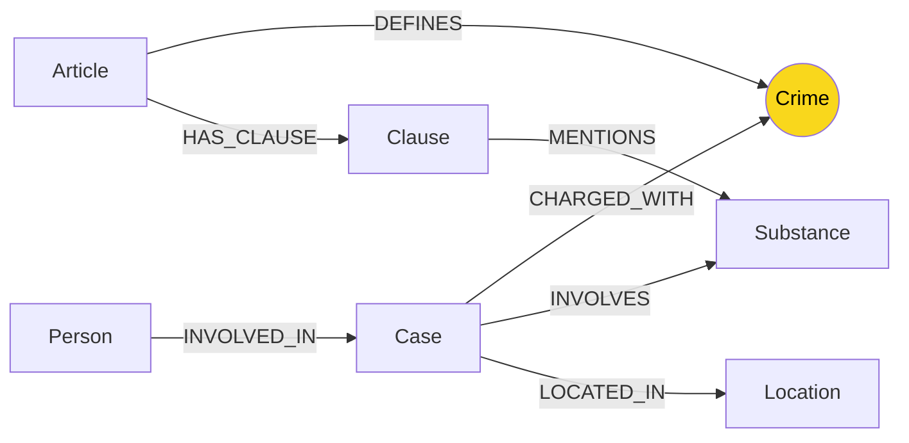

# Thiết kế Ontology — Day 19

**Họ tên:** Vũ Đình Thư  **MSSV:** 2A202602652

**Lựa chọn** (đánh dấu một):
- [x] Dùng ontology gợi ý (có thể chỉnh nhỏ)
- [ ] Tự thiết kế (xét bonus +15, xem `SUBMISSION.md`)

> Hướng dẫn: `LAB_GUIDE.md` Bước 2. Dùng ontology gợi ý thì vẫn phải điền đủ các mục dưới đây bằng lời của bạn.

## 1. Sơ đồ

Vẽ bằng mermaid (hoặc chèn ảnh `report/img/ontology.png`). Đánh dấu rõ **node cầu nối**.

## 2. Entity types (node labels)

| Label | Ý nghĩa | Khóa định danh (`MERGE` theo) | Properties | Lấy từ KB nào | Trích bằng (regex / LLM / khác) |
| --- | --- | --- | --- | --- | --- |
| Article | Một Điều luật | `id` | `id`, `title`, `law`, `doc_id` | Luật | regex |
| Clause | Một khoản của Điều luật | `id` | `id`, `number`, `penalty`, `text`, `doc_id` | Luật | regex |
| Crime | Tội danh chuẩn, dùng chung giữa hai KB | `name` | `name` | Luật + tin tức | regex + `link_entity` |
| Case | Một vụ việc được bài báo mô tả | `name` | `name`, `summary`, `date`, `source_title`, `doc_id` | Tin tức | LLM |
| Person | Cá nhân liên quan đến vụ việc | `name` | `name`, `aliases` | Tin tức | LLM |
| Substance | Chất ma túy/tên chất chuẩn | `name` | `name` | Luật + tin tức | regex + LLM |
| Location | Địa điểm của vụ việc | `name` | `name` | Tin tức | LLM |

## 3. Relationships

| Type | Từ → Đến | Properties trên cạnh | Ý nghĩa |
| --- | --- | --- | --- |
| `DEFINES` | `Article` → `Crime` | Không | Điều luật quy định tội danh |
| `HAS_CLAUSE` | `Article` → `Clause` | Không | Điều có khoản |
| `MENTIONS` | `Clause` → `Substance` | Không | Khoản nhắc chất/định lượng chất |
| `CHARGED_WITH` | `Case` → `Crime` | Không | Vụ việc có tội danh bị buộc tội |
| `INVOLVES` | `Case` → `Substance` | `amount` | Vụ việc liên quan một chất, có thể có khối lượng |
| `INVOLVED_IN` | `Person` → `Case` | `role`, `charge`, `sentence` | Vai trò, tội danh và mức án của người trong vụ |
| `LOCATED_IN` | `Case` → `Location` | Không | Nơi xảy ra/xét xử vụ việc |

## 4. Node cầu nối giữa 2 KB

- **Node nào:** `Crime`.
- **Vì sao chọn node này:** Tin tức cho biết một người/vụ án bị buộc tội gì, còn luật định nghĩa chính tội danh đó ở một Điều. Vì vậy `Crime` là thực thể chung có ngữ nghĩa ổn định để nối hai KB.
- **Cách đảm bảo hai phía khớp tên** (chuẩn hóa, `link_entity`, danh sách chuẩn trong prompt…): Tội danh luật được regex trích thành danh sách chuẩn. Prompt LLM yêu cầu chọn đúng một phần tử trong danh sách này; sau đó `link_entity` chuẩn hóa chữ thường, bỏ tiền tố “tội”, khớp exact rồi fuzzy match ngưỡng 0.8. Hàm luôn trả cách viết chuẩn từ KB luật.
- **Khi nào cầu gãy, và bạn xử lý thế nào:** Cầu có thể gãy khi LLM bỏ sót tội danh, trích sai tội danh, hoặc không giữ biệt danh của người. Hệ thống không đoán bừa khi điểm giống thấp, nên tránh nối sai nhưng có thể thiếu đường đi; cần cải thiện prompt/aliases hoặc thêm bước kiểm tra thực thể.

## 5. Competency questions

Với mỗi câu trong `data/benchmark_kg.json`, ghi đường đi trên graph dùng để trả lời. Câu nào không trả lời được thì ghi rõ lý do.

| Câu | Đường đi (Cypher pattern) | Trả lời được? |
| --- | --- | --- |
| Q1 | `Article {doc_id}` → `HAS_CLAUSE` → `Clause`; vector retrieval đưa đúng văn bản Luật PCMT vào prompt | Có |
| Q2 | `Person` → `INVOLVED_IN` → `Case`; chunks tin tức giữ tên hai bị cáo | Có |
| Q3 | `Person` → `Case` → `Crime` ← `Article` → `Clause` | Có |
| Q4 | `Person` → `Case` → `Crime` ← `Article` → `Clause` | Có; benchmark truy hồi được hành vi nhưng thiếu khoản có khung tối đa |
| Q5 | `Person` → `Case` → `INVOLVES` → `Substance` và `Case` → `Crime` ← `Article` → `Clause` → `MENTIONS` → `Substance` | Có |
| Q6 | `Case` → `INVOLVES` → `Substance {name: 'MDMA'}` | Có; truy hồi top-k hiện chỉ đưa một phần các Case vào prompt |

## 6. Quyết định thiết kế và đánh đổi

Ít nhất 3 quyết định. Mỗi quyết định ghi: đã chọn gì, phương án khác là gì, vì sao chọn.

1. **Chọn `Crime` làm node cầu nối thay vì nối thẳng `Case` với `Article`.** Phương án nối thẳng đơn giản hơn nhưng lặp cạnh và khó tái sử dụng một tội danh cho nhiều vụ; `Crime` phản ánh đúng ngữ nghĩa pháp lý và hỗ trợ multi-hop.
2. **Dùng regex cho luật, LLM cho tin tức.** Có thể dùng LLM cho cả hai, nhưng Điều/khoản luật có cấu trúc đều nên regex rẻ, nhất quán và không hallucinate. Tin tức là văn xuôi nên cần LLM nhận diện người, biệt danh, vai trò và vụ việc.
3. **Chỉ lấy khoản 1 và các khoản có chất liên quan.** Lấy mọi khoản cho đầy đủ hơn nhưng làm prompt dài và tốn tiền. Lọc như vậy giữ khung cơ bản cho Q3 và khoản MDMA cho Q5; đổi lại có thể thiếu ngữ cảnh ở một số câu.

## 7. So với ontology gợi ý (bắt buộc nếu xét bonus)

| Điểm khác | Gợi ý làm gì | Bạn làm gì | Vấn đề nó giải quyết | Bằng chứng (Cypher, hoặc số liệu benchmark) |
| --- | --- | --- | --- | --- |
| | | | | |

## 8. Hạn chế còn lại

- Truy vấn hiện chỉ lấy khoản 1 và khoản theo chất ma túy; vì vậy có thể thiếu khung tối đa khi câu hỏi hỏi mức án cao nhất (thể hiện ở Q4).
- `GraphRAGAgent` chỉ mở rộng từ top-k vector chunks. Câu hỏi tổng hợp như Q6 cần quét toàn graph theo `Substance`, thay vì chỉ các Case nằm cạnh kết quả vector.
- `Case.name` là tên ngắn do LLM tạo, nên cách đặt tên có thể thay đổi theo lần chạy; cần một khóa nguồn bền hơn nếu mở rộng hệ thống.
